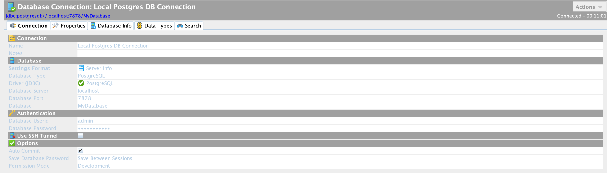

# LocalPostgresDockerSetup
 Locally Run Postgres Databse in Docker Container and Execute Init Scripts

## Pre-Requisite

* Docker Desktop

## Run

Fork the repository and then clone it into your local machine.

Open terminal, go inside the project directory and run :

```
docker-compose up -d
```

It will create a volume with name **localpostgresdockersetup_postgres_data** that will be used for storing postgres data. 

Also It will start the Postgres at **localhost** server and port **7878**. 
Database with name **MyDatabase** will be created and scripts will run inside this database.



## Develoeper Setup

* Make sure that docker is installed on your system and is running.
* Fork the repository and then clone it into your local machine.
* Open the repository in Visual Studio Code.
* Paste your sql scripts in [dbinit.sql](sqlScripts/dbinit.sql) file.
* Open a new Terminal & Run the docker contaier using below command.

```
docker-compose up
```

* To Delete the exising Docker Volume For a Fresh Re-Run
```
docker container rm Postgres_Local_Setup_Container

docker volume rm localpostgresdockersetup_postgres_data
```

* To Visualize the Database, Tables And its Data, make a connection to this database using **DbVisualizer** using the following properties : 
  * Database Type : PostgreSQL
  * Driver (JDBC) : PostgreSQL
  * Database Server : localhost
  * Database Port : 7878
  * Database : MyDatabase
  * Database UserId : admin
  * Database Password : superdooper